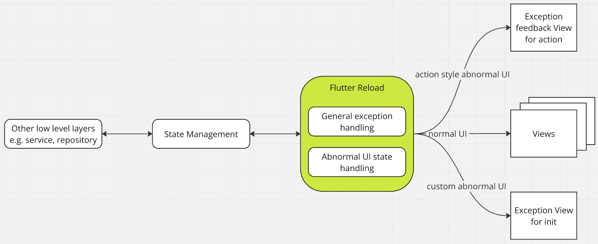
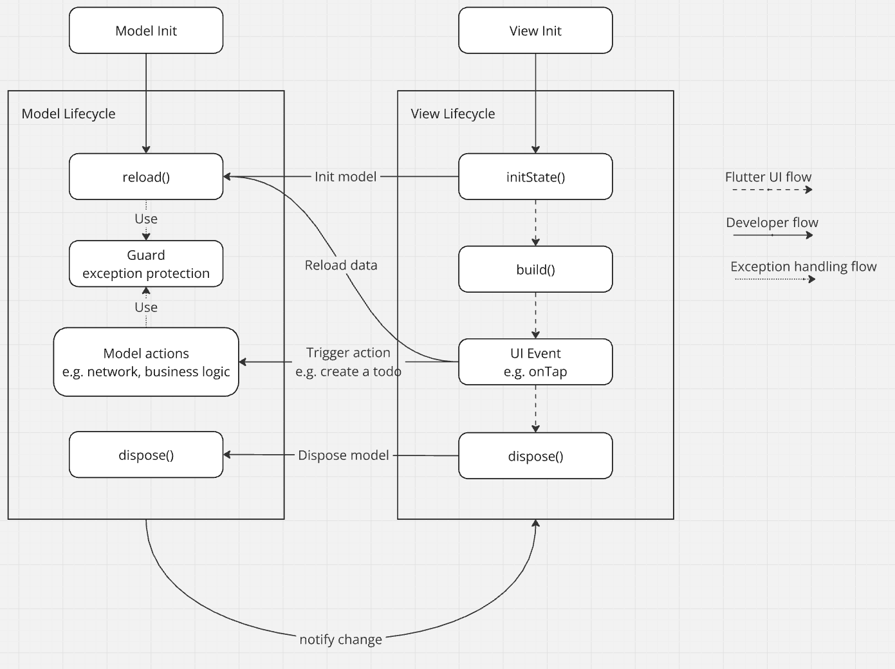

# flutter_reload
Simplifies error handling by managing low-level errors, allowing developers to focus solely on business logic.

## Why use `flutter_reload`
We love and usually choose one of many state management mechanisms as our base architecture.
In the case of using networking APIs, there is always a need for a “when” condition to handle exceptions in each view.

`flutter_reload` tries to create a lightweight layer to handle all common cases, so we don’t need to manage each exception case for every user action or view (page) loading.

This is a simple concept of what `flutter_reload` is and what it serves.

*flutter_reload architecture*


*flutter_reload lifecycle*


## Install
You can easily integrate flutter_reload with 3 major steps:

1. Initiate configuration for `exception handling` and `abnormal UI builder`.

```dart
void main() {
  ReloadConfiguration.init(
    abnormalStateBuilder: globalAbnormalStateBuilder,
    exceptionHandle: globalExceptionHandle,
  );
  runApp(const MyApp());
}

Widget? globalAbnormalStateBuilder(BuildContext context, GuardState guardState,
    DataSupplier<FutureOr<void>> dataReloader) {
  switch (guardState) {
    case InitGuardState():
      return const Center(child: CircularProgressIndicator.adaptive());
    case OfflineGuardState():
      return const Center(child: Text('Offline...'));
    case ErrorGuardState<CustomException>(cause: CustomException cause):
      return Center(child: Text('Error: ${cause.message}'));
    case ErrorGuardState<Exception>(cause: var cause):
      return Center(child: Text('Error: $cause'));
    default:
      return null;
  }
}

void globalExceptionHandle(
  exception,
  stackTrace, {
  GuardViewController? guardViewController,
  GuardExceptionHandleResult Function(dynamic, dynamic)? onError,
  required bool silent,
}) {
  final errorHandlerResult = onError?.call(exception, stackTrace) ??
      GuardExceptionHandleResult.byDefault;

  if (guardViewController != null &&
      guardViewController.value is InitGuardState) {
    
    // TODO: log unexpected error here
    guardViewController.value = ErrorGuardState<Exception>(cause: exception);
  } else {
    if (errorHandlerResult == GuardExceptionHandleResult.mute) {
      return;
    } else {
      // TODO: log unexpected error here
      ScaffoldMessenger.of(rootContext!)
          .showSnackBar(SnackBar(content: Text('$exception')));
    }
  }
}
```

2. support reload lifecycle in your (UI) model.

```dart
class MyViewModel extends GuardViewModel {
  final randomWords = <String>[];

  MyViewModel() : super(GuardState.init);

  @override
  FutureOr<void> reload() async {
    await guard(() async {
      guardViewController.value = GuardState.init;
      randomWords..clear()..addAll(await myNetworkService.getRandomWordsFromServer());
      guardViewController.value = GuardState.normal;
      notifyListeners();
    });
  }
}
```

3. use `GuardView()` for your UI.

```dart
@override
Widget build(BuildContext context) {
  return GuardView(
    model: myViewModel,
    builder: (context) {
      return ListenableWidget(
        model: myViewModel,
        builder: (context) {
          return ListView.separated(
            itemBuilder: (BuildContext context, int index) {
              final rowData = myViewModel.randomWords[index];
              return ListTile(
                key: ValueKey(rowData),
                title: Text(rowData),
              );
            },
            separatorBuilder: (context, index) => const Divider(),
            itemCount: myViewModel.randomWords.length,
          );
        },
      );
    },
  );
}
```
