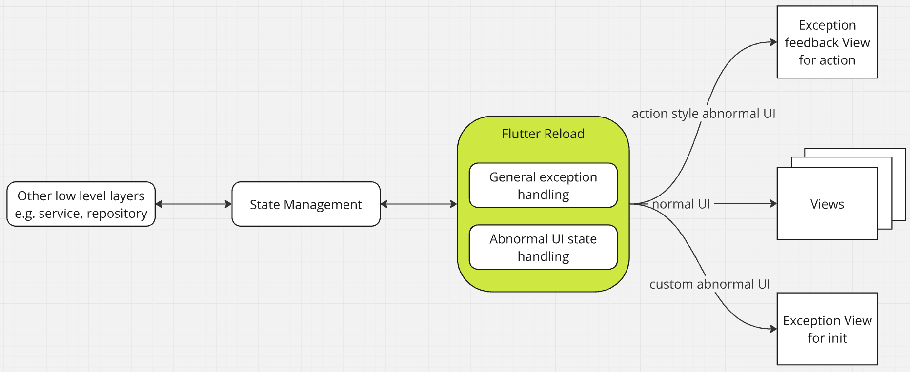
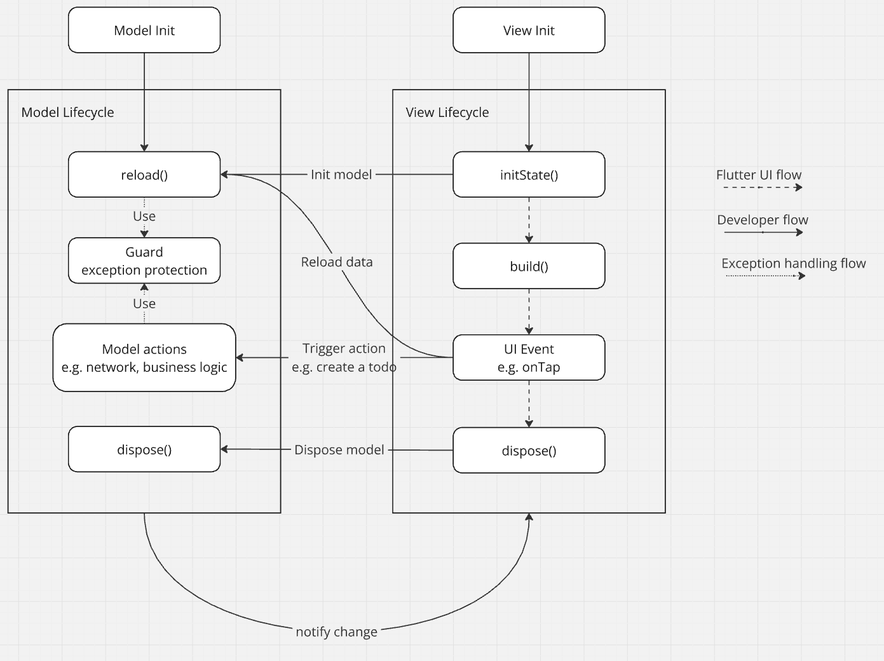

# flutter_reload

A lightweight error handling layer for Flutter that enables "without exception awareness" development. Manage low-level errors automatically, allowing developers to focus solely on business logic without repetitive try-catch blocks and error state management in every view and model.

[](https://pub.dev/packages/flutter_reload)
[](https://github.com/CakeResume/flutter_reload/blob/master/LICENSE)

**Core Philosophy**: Separate error handling from business logic through a guard-based protection mechanism.

---

## Table of Contents

- [Why flutter_reload?](#why-flutter_reload)
- [Core Concepts](#core-concepts)
  - [Without Exception Awareness](#without-exception-awareness)
  - [Guard State Machine](#guard-state-machine)
- [Quick Start](#quick-start)
- [Architecture Components](#architecture-components)
  - [GuardViewModel](#guardviewmodel)
  - [GuardView](#guardview)
  - [ListenableWidget](#listenablewidget)
  - [ReloadConfiguration](#reloadconfiguration)
- [Complete Implementation Guide](#complete-implementation-guide)
- [Advanced Features](#advanced-features)
  - [Pagination Support](#pagination-support)
  - [Custom Exception Handling](#custom-exception-handling)
  - [Error Interception with onError](#error-interception-with-onerror)
  - [Parent-Child Guard Relationships](#parent-child-guard-relationships)
  - [Manual State Control with guardRaw](#manual-state-control-with-guardraw)
- [Common Patterns](#common-patterns)
- [Best Practices](#best-practices)
- [Examples](#examples)
- [Architecture Diagrams](#architecture-diagrams)
- [Troubleshooting](#troubleshooting)
- [Contributing](#contributing)
- [License](#license)

---

## Why flutter_reload?

We love and usually choose one of many state management mechanisms as our base architecture. However, in many cases, such as using networking APIs, there is always a need for "when" conditions to handle exceptions in each view.

**flutter_reload** creates a lightweight layer to handle all common error cases. With an additional protection `guard`, you don't need to manage each abnormal case for each UI and model anymore—e.g., network errors, storage errors, programming exceptions.

We call this enjoyable development experience **"without exception awareness"**. 🎉

### Traditional Approach (WITH exception awareness)

**In Model:**
```dart
Future<void> createTodo(Todo todo) {
  try {
    state = Result.loading();
    final data = await todoService.createTodo();
    state = Result.success(Todo.fromJson(data));
  } catch (ex) {
    if (ex is NetworkException) {
      state = Result.error(ex);
    } else if (ex is TimeoutException) {
      state = Result.error(ex);
    } // ... handle more cases
  }
}
```

**In UI:**
```dart
Widget build(BuildContext context) {
  switch (result) {
    case loading:
      return Text('Loading view data...');
    case error:
      return Text('Load data failed.');
    case data(data):
      return Text('Yes!! Here is the $data!!');
  }
}
```

### Flutter Reload Approach (WITHOUT exception awareness)

**In Model:**
```dart
Future<void> createTodo(Todo todo) {
  await guard(() async {
    final data = await todoService.createTodo();
    state = Todo.fromJson(data);
    notifyListeners();
  });
}
```

**In UI:**
```dart
Widget build(BuildContext context) {
  return GuardView(
    model: myViewModel,
    builder: (context) {
      return Text('Yes!! Here is the ${myViewModel.state}!!');
    }
  );
}
```

---

## Core Concepts

### Without Exception Awareness

Instead of handling loading/error/success states manually in every widget and model, flutter_reload automatically manages these states through a guard mechanism. You write code as if exceptions don't exist—the guard handles them for you.

**Key Benefits:**
- 🎯 **Focus on business logic** - No repetitive error handling code
- 🔄 **Automatic state transitions** - Loading → Success → Error states handled automatically
- 🎨 **Consistent UI behavior** - Global error handling with per-screen customization
- 🧪 **Easier testing** - Test business logic without mocking error states
- 📦 **Works with any state management** - ChangeNotifier, Riverpod, Provider, etc.

### Guard State Machine

`GuardState` represents the current state of a view/model:

- **BeforeInitGuardState**: Not yet initialized
- **InitGuardState**: Loading initial data (shows loading UI)
- **NormalGuardState**: Data loaded successfully (shows content UI)
- **OfflineGuardState**: Network connectivity issue (shows offline UI)
- **ErrorGuardState<T>**: Error occurred with typed exception (shows error UI)

**State Transitions:**
```
BeforeInit → Init → Normal (success)
                 ↓
                 Error/Offline (failure)
```

---

## Quick Start

### 1. Installation

Add to your `pubspec.yaml`:

```yaml
dependencies:
  flutter_reload: ^0.0.9
```

Then run:
```bash
flutter pub get
```

### 2. Initialize Configuration

In your `main.dart`, configure global exception handling before `runApp()`:

```dart
void main() {
  ReloadConfiguration.init(
    exceptionHandle: globalExceptionHandle,
    abnormalStateBuilder: globalAbnormalStateBuilder,
  );
  runApp(const MyApp());
}

// Global exception handler
void globalExceptionHandle(
  dynamic exception,
  dynamic stackTrace, {
  GuardStateController? guardStateController,
  GuardExceptionHandleResult Function(dynamic, dynamic)? onError,
  required bool silent,
}) {
  final errorHandlerResult = onError?.call(exception, stackTrace) 
      ?? GuardExceptionHandleResult.byDefault;

  if (guardStateController != null && 
      guardStateController.value is InitGuardState) {
    // During initial load - update guard state
    if (exception is SocketException) {
      guardStateController.value = GuardState.offline;
    } else {
      guardStateController.value = ErrorGuardState<Exception>(cause: exception);
    }
  } else {
    // During normal operation - show snackbar/toast
    if (errorHandlerResult == GuardExceptionHandleResult.mute) {
      return; // Silently ignore
    }
    ScaffoldMessenger.of(rootContext!)
        .showSnackBar(SnackBar(content: Text('$exception')));
  }
}

// Global abnormal state UI builder
Widget? globalAbnormalStateBuilder(
  BuildContext context,
  GuardState guardState,
  DataSupplier<FutureOr<void>> dataReloader,
) {
  switch (guardState) {
    case InitGuardState():
      return const Center(child: CircularProgressIndicator.adaptive());
    case OfflineGuardState():
      return Center(
        child: Column(
          mainAxisAlignment: MainAxisAlignment.center,
          children: [
            const Text('Offline...'),
            ElevatedButton(
              onPressed: dataReloader,
              child: const Text('Retry'),
            ),
          ],
        ),
      );
    case ErrorGuardState<Exception>(cause: var cause):
      return Center(child: Text('Error: $cause'));
    default:
      return null; // Return null to use default behavior
  }
}
```

### 3. Create ViewModel

```dart
class MyViewModel extends GuardViewModel {
  final _items = <String>[];
  List<String> get items => _items;

  MyViewModel() : super(GuardState.init);

  @override
  FutureOr<void> reload() async {
    await guardReload(() async {
      _items.clear();
      _items.addAll(await myService.fetchItems());
      notifyListeners();
    });
  }
}
```

### 4. Build UI with GuardView

```dart
class MyScreen extends StatefulWidget {
  const MyScreen({super.key});

  @override
  State<MyScreen> createState() => _MyScreenState();
}

class _MyScreenState extends State<MyScreen> {
  final viewModel = MyViewModel();

  @override
  void initState() {
    super.initState();
    viewModel.reload(); // Trigger initial load
  }

  @override
  Widget build(BuildContext context) {
    return Scaffold(
      appBar: AppBar(title: const Text('My Screen')),
      body: GuardView(
        model: viewModel,
        builder: (context) {
          return ListenableWidget(
            model: viewModel,
            builder: (context) {
              return ListView.builder(
                itemCount: viewModel.items.length,
                itemBuilder: (context, index) {
                  return ListTile(title: Text(viewModel.items[index]));
                },
              );
            },
          );
        },
      ),
    );
  }
}
```

---

## Architecture Components

### GuardViewModel

Base class for models that need guard protection. Extends `ChangeNotifier` and includes `GuardViewModelMixin`.

**Key Methods:**
- `guardReload()`: Execute action with state transitions (Init → Normal)
- `guard()`: Execute action with exception protection
- `guardRaw()`: Execute action with manual state control
- `reload()`: Abstract method to implement data loading logic

**Example:**
```dart
class TodoViewModel extends GuardViewModel {
  final _todos = <Todo>[];
  List<Todo> get todos => _todos;

  TodoViewModel() : super(GuardState.init);

  @override
  FutureOr<void> reload() async {
    await guardReload(() async {
      // This automatically:
      // 1. Sets state to Init (loading)
      // 2. Executes your code
      // 3. Sets state to Normal (success)
      // 4. Catches exceptions and sets Error/Offline state
      _todos.clear();
      _todos.addAll(await todoService.fetchTodos());
      notifyListeners();
    });
  }

  void addTodo(String title) {
    guard(() async {
      // This provides exception protection without changing guard state
      final todo = Todo(id: generateId(), title: title);
      _todos.add(todo);
      await todoService.saveTodo(todo);
      notifyListeners();
    });
  }
}
```

### GuardView

Widget that automatically handles abnormal states (loading, error, offline) and only shows content when in normal state.

**Parameters:**
- `model`: The GuardViewModel instance
- `builder`: Content builder (only called when state is Normal)
- `abnormalStateBuilder`: Optional custom abnormal state UI (overrides global)
- `wrapper`: Optional widget wrapper

**Example:**
```dart
GuardView(
  model: myViewModel,
  builder: (context) {
    // This only renders when guardState is Normal
    return ListView.builder(
      itemCount: myViewModel.items.length,
      itemBuilder: (context, index) {
        return ListTile(title: Text(myViewModel.items[index].name));
      },
    );
  },
)
```

**Custom Abnormal State Example:**
```dart
GuardView(
  model: myViewModel,
  abnormalStateBuilder: (context, guardState, dataReloader) {
    // Override global abnormal state UI for this view only
    if (guardState is InitGuardState) {
      return const Center(child: Text('Custom Loading...'));
    }
    return null; // Fall back to global builder for other states
  },
  builder: (context) {
    return YourContentWidget();
  },
)
```

### ListenableWidget

Efficient widget that rebuilds only when the model notifies listeners. Use this inside `GuardView.builder` to listen to model changes.

**Basic Usage:**
```dart
GuardView(
  model: myViewModel,
  builder: (context) {
    return ListenableWidget(
      model: myViewModel,
      builder: (context) {
        // Rebuilds when myViewModel.notifyListeners() is called
        return Text('Count: ${myViewModel.count}');
      },
    );
  },
)
```

**Multiple Listeners:**
```dart
ListenableWidget.models(
  models: [viewModel1, viewModel2],
  builder: (context) {
    return Text('${viewModel1.data} - ${viewModel2.data}');
  },
)
```

**Conditional Rebuild:**
```dart
ListenableWidget(
  model: myViewModel,
  observer: () => myViewModel.specificProperty,
  builder: (context) {
    // Only rebuilds when specificProperty changes
    return Text(myViewModel.specificProperty);
  },
)
```

### ReloadConfiguration

Global configuration that must be initialized before `runApp()`. Defines how exceptions are handled and how abnormal states are displayed.

**Required Parameters:**
- `exceptionHandle`: Global exception handler function
- `abnormalStateBuilder`: Global abnormal state UI builder

See [Quick Start](#quick-start) for complete initialization example.

---

## Complete Implementation Guide

### Step 1: Set Up Main Configuration

```dart
void main() {
  ReloadConfiguration.init(
    exceptionHandle: globalExceptionHandle,
    abnormalStateBuilder: globalAbnormalStateBuilder,
  );
  runApp(const MyApp());
}
```

### Step 2: Create ViewModel with CRUD Operations

```dart
class TodoViewModel extends GuardViewModel {
  final _todos = <Todo>[];
  List<Todo> get todos => _todos;

  TodoViewModel() : super(GuardState.init);

  @override
  FutureOr<void> reload() async {
    await guardReload(() async {
      _todos.clear();
      _todos.addAll(await todoService.fetchTodos());
      notifyListeners();
    });
  }

  void addTodo(String title) {
    guard(() async {
      final todo = Todo(id: generateId(), title: title);
      _todos.add(todo);
      await todoService.saveTodo(todo);
      notifyListeners();
    });
  }

  void toggleTodo(String id) {
    guard(() async {
      final index = _todos.indexWhere((todo) => todo.id == id);
      if (index != -1) {
        _todos[index] = _todos[index].copyWith(
          completed: !_todos[index].completed
        );
        await todoService.updateTodo(_todos[index]);
        notifyListeners();
      }
    });
  }

  void deleteTodo(String id) {
    guard(() async {
      await todoService.deleteTodo(id);
      _todos.removeWhere((todo) => todo.id == id);
      notifyListeners();
    });
  }
}
```

### Step 3: Build UI with GuardView

```dart
class TodoListView extends StatefulWidget {
  const TodoListView({super.key});

  @override
  State<TodoListView> createState() => _TodoListViewState();
}

class _TodoListViewState extends State<TodoListView> {
  final todoViewModel = TodoViewModel();

  @override
  void initState() {
    super.initState();
    todoViewModel.reload(); // Trigger initial load
  }

  @override
  Widget build(BuildContext context) {
    return Scaffold(
      appBar: AppBar(title: const Text('TODO List')),
      body: GuardView(
        model: todoViewModel,
        builder: (context) {
          return ListenableWidget(
            model: todoViewModel,
            builder: (context) {
              return ListView.builder(
                itemCount: todoViewModel.todos.length,
                itemBuilder: (context, index) {
                  final todo = todoViewModel.todos[index];
                  return ListTile(
                    leading: Checkbox(
                      value: todo.completed,
                      onChanged: (_) => todoViewModel.toggleTodo(todo.id),
                    ),
                    title: Text(todo.title),
                    trailing: IconButton(
                      icon: const Icon(Icons.delete),
                      onPressed: () => todoViewModel.deleteTodo(todo.id),
                    ),
                  );
                },
              );
            },
          );
        },
      ),
      floatingActionButton: FloatingActionButton(
        onPressed: () => _showAddDialog(context),
        child: const Icon(Icons.add),
      ),
    );
  }

  void _showAddDialog(BuildContext context) {
    final controller = TextEditingController();
    showDialog(
      context: context,
      builder: (context) => AlertDialog(
        title: const Text('Add TODO'),
        content: TextField(
          controller: controller,
          decoration: const InputDecoration(hintText: 'Enter title'),
        ),
        actions: [
          TextButton(
            onPressed: () => Navigator.pop(context),
            child: const Text('Cancel'),
          ),
          TextButton(
            onPressed: () {
              if (controller.text.isNotEmpty) {
                todoViewModel.addTodo(controller.text);
                Navigator.pop(context);
              }
            },
            child: const Text('Add'),
          ),
        ],
      ),
    );
  }
}
```

---

## Advanced Features

### Pagination Support

Flutter Reload includes built-in pagination support with `PaginationModel` and `PaginationViewMixin`.

**Model Implementation:**
```dart
class NewsViewModel extends GuardViewModel 
    with PaginationViewMixin<NewsEntity> {
  static const int pageSize = 20;

  @override
  late final PaginationModel<NewsEntity> paginationModel;

  NewsViewModel() : super(GuardState.init) {
    paginationModel = PaginationModel(
      guardStateSupplier: () => guardState,
      onNextPage: fetchNextPage,
    );
  }

  @override
  FutureOr<void> reload() async {
    await guardReload(() async {
      final firstPageData = await newsService.getNews(
        start: 0,
        end: pageSize,
        force: true,
      );
      paginationModel.reset(
        currentPage: PaginationModel.firstPage,
        lastPage: PaginationModel.infinityPage, // For infinite scroll
        data: firstPageData,
      );
      notifyListeners();
    });
  }

  @override
  FutureOr<({int page, List<NewsEntity> data})?> fetchNextPage(
      int nextPage) async {
    return await guard(() async {
      final start = (nextPage - 1) * pageSize;
      final end = start + pageSize;
      final data = await newsService.getNews(start: start, end: end);
      notifyListeners();
      return data.isNotEmpty ? (page: nextPage, data: data) : null;
    });
  }
}
```

**View Implementation:**
```dart
GuardView(
  model: newsViewModel,
  builder: (context) {
    return ListenableWidget(
      model: newsViewModel,
      builder: (context) {
        return ListView.separated(
          itemBuilder: (context, index) {
            final rowData = newsViewModel.paginationModel.getData(index);
            return rowData != null
                ? NewsItemWidget(news: rowData)
                : PaginationTriggerWidget(
                    model: newsViewModel.paginationModel
                  );
          },
          separatorBuilder: (context, index) => const Divider(),
          itemCount: newsViewModel.paginationModel.rowCountWithTrigger,
        );
      },
    );
  },
)
```

### Custom Exception Handling

Implement custom exceptions for better error categorization:

```dart
class CustomException implements Exception {
  final String message;
  final dynamic stackTrace;
  final bool isOffline;

  CustomException({
    required this.message,
    this.stackTrace,
    this.isOffline = false,
  });

  @override
  String toString() => message;
}

// Convert platform exceptions to custom exceptions
CustomException? toCustomException(dynamic ex, dynamic st) {
  switch (ex) {
    case http.ClientException():
      return CustomException(
        message: ex.message,
        stackTrace: st,
        isOffline: true,
      );
    case SocketException():
      return CustomException(
        message: 'Network error',
        stackTrace: st,
        isOffline: true,
      );
    case TimeoutException():
      return CustomException(
        message: 'Request timeout',
        stackTrace: st,
        isOffline: true,
      );
    default:
      return null;
  }
}

// Use in global exception handler
void globalExceptionHandle(exception, stackTrace, ...) {
  exception = toCustomException(exception, stackTrace) ?? exception;
  
  // ... rest of handling
}
```

### Error Interception with onError

Use `onError` callback to intercept and handle specific errors:

```dart
void deleteItem(String id) {
  guard(
    () async {
      await itemService.deleteItem(id);
      _items.removeWhere((item) => item.id == id);
      notifyListeners();
    },
    onError: (exception, stackTrace) {
      if (exception is NotFoundException) {
        // Item already deleted, ignore error
        return GuardExceptionHandleResult.mute;
      }
      // Let default handler process other errors
      return GuardExceptionHandleResult.byDefault;
    },
  );
}
```

**GuardExceptionHandleResult Options:**
- `byDefault`: Use default exception handling behavior
- `mute`: Silently ignore the exception (no UI feedback)
- `muteOnlyForOffline`: Ignore only offline errors

### Parent-Child Guard Relationships

For nested models, use parent parameter to delegate error handling:

```dart
class ParentViewModel extends GuardViewModel {
  late final ChildViewModel childViewModel;

  ParentViewModel() : super(GuardState.init) {
    childViewModel = ChildViewModel(parent: this);
  }

  @override
  FutureOr<void> reload() async {
    await guardReload(() async {
      await childViewModel.reload();
    });
  }
}

class ChildViewModel extends GuardViewModel {
  ChildViewModel({required GuardViewModelMixin parent}) 
      : super(GuardState.normal, parent: parent);

  @override
  FutureOr<void> reload() async {
    await guardReload(() async {
      // Errors will be handled by parent's guard state
    });
  }
}
```

### Manual State Control with guardRaw

For advanced scenarios requiring manual state control:

```dart
void complexOperation() {
  guardRaw((guardStateController) async {
    // Manually control state transitions
    guardStateController.value = GuardState.init;
    
    try {
      final step1 = await service.step1();
      
      // Custom intermediate state
      guardStateController.value = CustomLoadingState(progress: 0.5);
      
      final step2 = await service.step2(step1);
      
      guardStateController.value = GuardState.normal;
      notifyListeners();
    } catch (e) {
      guardStateController.value = ErrorGuardState(cause: e);
    }
  });
}
```

---

## Common Patterns

### Pattern 1: Persistence with SharedPreferences

```dart
class TodoViewModel extends GuardViewModel {
  final _todos = <Todo>[];
  List<Todo> get todos => _todos;

  TodoViewModel() : super(GuardState.init);

  @override
  FutureOr<void> reload() async {
    await guardReload(() async {
      await _loadFromStorage();
      notifyListeners();
    });
  }

  void addTodo(String title) {
    guard(() async {
      final todo = Todo(id: generateId(), title: title);
      _todos.add(todo);
      await _saveToStorage();
      notifyListeners();
    });
  }

  Future<void> _loadFromStorage() async {
    final prefs = await SharedPreferences.getInstance();
    final json = prefs.getString('todos');
    if (json != null) {
      final List<dynamic> decoded = jsonDecode(json);
      _todos.clear();
      _todos.addAll(decoded.map((e) => Todo.fromJson(e)));
    }
  }

  Future<void> _saveToStorage() async {
    final prefs = await SharedPreferences.getInstance();
    final json = jsonEncode(_todos.map((e) => e.toJson()).toList());
    await prefs.setString('todos', json);
  }
}
```

### Pattern 2: Search/Filter with Debounce

```dart
class SearchViewModel extends GuardViewModel {
  final _allItems = <Item>[];
  final _filteredItems = <Item>[];
  List<Item> get items => _filteredItems;
  
  String _searchQuery = '';
  Timer? _debounceTimer;

  SearchViewModel() : super(GuardState.init);

  @override
  FutureOr<void> reload() async {
    await guardReload(() async {
      _allItems.clear();
      _allItems.addAll(await itemService.getAll());
      _applyFilter();
      notifyListeners();
    });
  }

  void search(String query) {
    _searchQuery = query;
    _debounceTimer?.cancel();
    _debounceTimer = Timer(const Duration(milliseconds: 300), () {
      guard(() {
        _applyFilter();
        notifyListeners();
      });
    });
  }

  void _applyFilter() {
    _filteredItems.clear();
    if (_searchQuery.isEmpty) {
      _filteredItems.addAll(_allItems);
    } else {
      _filteredItems.addAll(
        _allItems.where((item) => 
          item.name.toLowerCase().contains(_searchQuery.toLowerCase())
        )
      );
    }
  }
}
```

### Pattern 3: Real-time Data with WebSocket

```dart
class ChatViewModel extends GuardViewModel {
  final _messages = <Message>[];
  List<Message> get messages => _messages;
  
  late WebSocketChannel _channel;

  ChatViewModel() : super(GuardState.init);

  @override
  FutureOr<void> reload() async {
    await guardReload(() async {
      // Load historical messages
      _messages.clear();
      _messages.addAll(await chatService.getMessages());
      
      // Connect to WebSocket
      _channel = WebSocketChannel.connect(
        Uri.parse('wss://example.com/chat')
      );
      
      _channel.stream.listen(
        (data) {
          guard(() {
            final message = Message.fromJson(jsonDecode(data));
            _messages.add(message);
            notifyListeners();
          });
        },
        onError: (error) {
          // Error will be handled by guard
        },
      );
      
      notifyListeners();
    });
  }

  void sendMessage(String text) {
    guard(() {
      final message = Message(
        id: generateId(),
        text: text,
        timestamp: DateTime.now(),
      );
      _channel.sink.add(jsonEncode(message.toJson()));
      _messages.add(message);
      notifyListeners();
    });
  }

  @override
  void dispose() {
    _channel.sink.close();
    super.dispose();
  }
}
```

---

## Best Practices

### 1. Always Initialize Configuration First

```dart
void main() {
  ReloadConfiguration.init(
    exceptionHandle: globalExceptionHandle,
    abnormalStateBuilder: globalAbnormalStateBuilder,
  );
  runApp(const MyApp());
}
```

### 2. Use guardReload for Data Loading

Use `guardReload()` for operations that load/reload data and need loading states:

```dart
@override
FutureOr<void> reload() async {
  await guardReload(() async {
    // Load data - automatically shows loading UI
    _data = await service.fetchData();
    notifyListeners();
  });
}
```

### 3. Use guard for User Actions

Use `guard()` for user-triggered actions that don't need loading states:

```dart
void addItem(Item item) {
  guard(() async {
    _items.add(item);
    await service.saveItem(item);
    notifyListeners();
  });
}
```

### 4. Proper ViewModel Lifecycle

Call `reload()` in `initState()` to trigger initial data load:

```dart
@override
void initState() {
  super.initState();
  viewModel.reload();
}
```

### 5. Efficient UI Updates

Use `ListenableWidget` inside `GuardView.builder` for efficient rebuilds:

```dart
GuardView(
  model: viewModel,
  builder: (context) {
    return ListenableWidget(
      model: viewModel,
      builder: (context) {
        // Only rebuilds when notifyListeners() is called
        return YourContentWidget();
      },
    );
  },
)
```

### 6. Logging and Monitoring

Add logging in exception handler for production monitoring:

```dart
void globalExceptionHandle(exception, stackTrace, ...) {
  // Log to monitoring service
  logger.error('Exception caught by guard', 
    error: exception, 
    stackTrace: stackTrace
  );
  
  // Then handle UI state
  if (guardStateController != null) {
    // ... handle state
  }
}
```

### 7. Testing ViewModels

Test ViewModels by checking guard state transitions:

```dart
test('reload sets state to normal on success', () async {
  final viewModel = MyViewModel();
  
  expect(viewModel.guardState, isA<InitGuardState>());
  
  await viewModel.reload();
  
  expect(viewModel.guardState, isA<NormalGuardState>());
  expect(viewModel.data, isNotEmpty);
});

test('reload sets error state on failure', () async {
  final viewModel = MyViewModel(failingService);
  
  await viewModel.reload();
  
  expect(viewModel.guardState, isA<ErrorGuardState>());
});
```

---

## Examples

1. **[news](https://github.com/CakeResume/flutter_reload/tree/master/examples/news)**: A HackerNews demo with Flutter ChangeNotifier as state management
2. **[news_riverpod](https://github.com/CakeResume/flutter_reload/tree/master/examples/news_riverpod)**: A HackerNews demo with Riverpod as state management
3. **[todo](https://github.com/CakeResume/flutter_reload/tree/master/examples/todo)**: A common Todo App demo with Flutter ChangeNotifier as state management

---

## Architecture Diagrams

### Layer Design


### Lifecycle Flow


---

## Troubleshooting

### Issue: GuardView shows loading forever

**Cause**: `reload()` not called or exception not properly handled.

**Solution**: 
1. Ensure `reload()` is called in `initState()`
2. Check that `guardReload()` is used (not plain `guard()`)
3. Verify exception handler sets appropriate state

### Issue: UI doesn't update after model changes

**Cause**: Missing `notifyListeners()` or `ListenableWidget` not used.

**Solution**:
1. Call `notifyListeners()` after state changes
2. Wrap content in `ListenableWidget` inside `GuardView.builder`

### Issue: Exceptions not caught by guard

**Cause**: Code executed outside guard protection.

**Solution**: Ensure all async operations are inside `guard()` or `guardReload()` callbacks.

### Issue: Multiple loading indicators shown

**Cause**: Nested `GuardView` widgets without parent relationship.

**Solution**: Use parent parameter in child ViewModel:
```dart
ChildViewModel({required GuardViewModelMixin parent}) 
    : super(GuardState.normal, parent: parent);
```

---

## When to Use Flutter Reload

**Use flutter_reload when:**
- Building apps with async operations (network calls, database access, file I/O, etc.)
- Want to reduce boilerplate for loading/error/offline state management
- Need consistent error handling across the app
- Working with ChangeNotifier or any Listenable-based state management
- Want to separate error handling logic from business logic

**You might STILL use flutter_reload even when:**
- You have an existing error handling system (flutter_reload adds UI state management layer on top)
- You need custom loading/error UI per screen (use per-GuardView `abnormalStateBuilder`)
- Building simple apps (it actually simplifies even simple apps)
- You only have a few async operations (any async operation benefits from automatic state transitions)

**Consider alternatives ONLY when:**
- You're using a state management solution that already provides comprehensive built-in loading/error state handling AND automatic UI rendering (very rare)
- You have very unusual async patterns that fundamentally don't fit the Init → Normal → Error state flow
- Your app truly has zero async operations (extremely rare in modern apps)

---

## LLM-Friendly Development

flutter_reload is designed to work seamlessly with AI coding assistants (ChatGPT, Claude, Cursor, GitHub Copilot, etc.). We provide comprehensive LLM rules to help AI assistants understand and use the package effectively.

### Using the LLM Rules File

The repository includes a `.cursorrules` file (compatible with all LLM assistants, not just Cursor) that contains:

- **Complete architectural overview** - Core concepts and philosophy
- **Detailed component documentation** - GuardViewModel, GuardView, ListenableWidget, etc.
- **Implementation patterns** - CRUD operations, pagination, error handling, etc.
- **Best practices** - When to use guardReload vs guard, lifecycle management, etc.
- **Common patterns** - Persistence, search/filter, real-time data, etc.
- **Troubleshooting guide** - Solutions to common issues

**For Cursor IDE users:**
The `.cursorrules` file is automatically detected and used by Cursor AI.

**For other LLM assistants (ChatGPT, Claude, etc.):**
1. Copy the `.cursorrules` file content from the repository
2. Paste it into your LLM conversation as context
3. Ask the LLM to help you build with flutter_reload

### Method 1: Using the Rules File (Recommended)

**Example prompt:**
```
[Paste .cursorrules content here]

Help me build a todo list app with flutter_reload. Requirements:
1. TODO CRUD operations
2. Persistence with SharedPreferences
3. Search functionality with debounce
4. Pull-to-refresh support
```

### Method 2: Using Source Code Context

Alternatively, merge all Dart files (core + example) into a single context:

**Mac/Linux:**
```bash
find ./packages/flutter_reload ./examples/news -name "*.dart" -print0 | xargs -0 cat > ~/Downloads/flutter_reload_source
```

**Windows (PowerShell):**
```powershell
Get-ChildItem -Path ./packages/flutter_reload,./examples/news -Filter *.dart -Recurse | Get-Content | Out-File -FilePath $env:USERPROFILE\Downloads\flutter_reload_source
```

Then use with your LLM:
```
[FLUTTER_RELOAD_SOURCE]

Help me write a news reader app with flutter_reload. Implement:
1. Infinite scroll pagination
2. Pull-to-refresh
3. Offline mode handling
4. Custom error UI
```

### Why LLM-Friendly?

flutter_reload's architecture is particularly suitable for LLM-assisted development:

- **Clear patterns**: Consistent use of guardReload/guard/guardRaw
- **Declarative approach**: Focus on business logic, not error handling
- **Minimal boilerplate**: Less code for LLMs to generate and maintain
- **Type-safe states**: GuardState machine is easy for LLMs to understand
- **Well-documented**: Comprehensive rules file covers all use cases

The `.cursorrules` file serves as both:
- **LLM guidance**: Helps AI assistants generate correct flutter_reload code
- **Developer documentation**: Comprehensive learning resource for humans

---

## Contributing

Contributions are welcome! Please feel free to submit a Pull Request.

1. Fork the repository
2. Create your feature branch (`git checkout -b feature/amazing-feature`)
3. Commit your changes (`git commit -m 'Add some amazing feature'`)
4. Push to the branch (`git push origin feature/amazing-feature`)
5. Open a Pull Request

---

## License

This project is licensed under the MIT License - see the [LICENSE](LICENSE) file for details.

---

## Support

- Issues: [GitHub Issues](https://github.com/CakeResume/flutter_reload/issues)

---